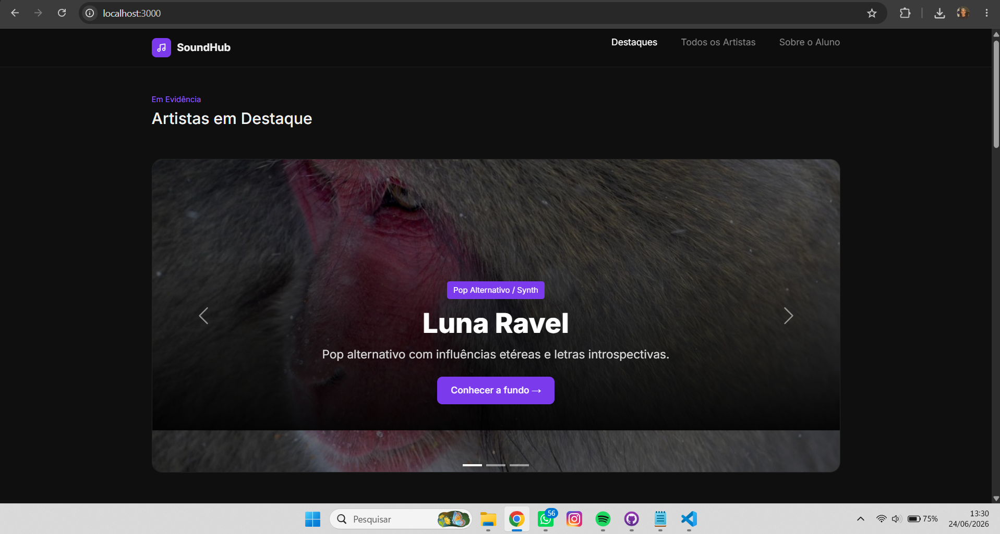
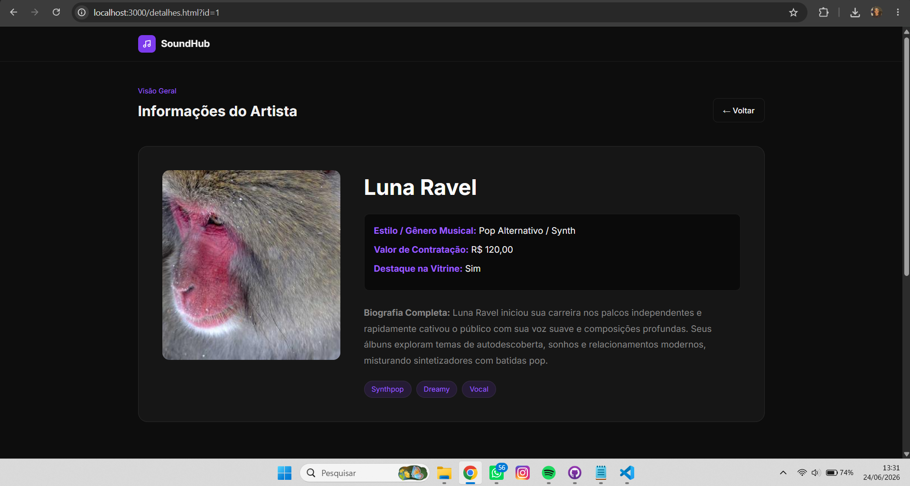

# Trabalho Prático - Semana 13

Nessa etapa, você irá evoluir o projeto do semestre, montando o ambiente de desenvolvimento mais completo, típico de projetos profissionais. Nesse processo, vamos utilizar um **servidor backend simulado** com o JSON Server que fornece uma APIs RESTful a partir de um arquivo JSON.

Para esse projeto, além de mudarmos o JSON para o JSON Server, vamos permitir o cadastro e alteração de dados da entidade principal (CRUD).

## Informações do trabalho

- Nome: Frederico Marcos de Paula Marques
- Matricula: 907680
- Proposta de projeto escolhida: Proposta 1 – Pessoas e Produções (Pessoa: Artista; Produções: Álbuns musicais)
- Breve descrição sobre seu projeto: O SoundHub é uma aplicação web que organiza e apresenta artistas musicais e seus respectivos álbuns em uma interface clara e intuitiva. A plataforma permite explorar informações sobre os artistas e suas produções de forma centralizada, facilitando a navegação e a descoberta de novos conteúdos musicais.

**Registros do trabalho**

<< DADOS DO DB.JSON (ENTIDADE PRINCIPAL E SECUNDÁRIA) >>

```json
{
  "categorias": [
    { "id": 1, "nome": "Pop Alternativo / Synth" },
    { "id": 2, "nome": "Indie Folk" },
    { "id": 3, "nome": "Lo-fi Hip-Hop / Beats" },
    { "id": 4, "nome": "Rock Alternativo" }
  ],
  "artistas": [
    {
      "id": 1,
      "nome": "Luna Ravel",
      "descricaoCurta": "Pop alternativo com influências etéreas e letras introspectivas.",
      "descricaoCompleta": "Luna Ravel iniciou sua carreira nos palcos independentes e rapidamente cativou o público com sua voz suave e composições profundas. Seus álbuns exploram temas de autodescoberta, sonhos e relacionamentos modernos, misturando sintetizadores com batidas pop.",
      "categoria": "Pop Alternativo / Synth",
      "preco": 120,
      "tags": ["Synthpop", "Dreamy", "Vocal", "Etéreo"],
      "destaque": true,
      "imagem": "[https://picsum.photos/seed/luna42/1200/500](https://picsum.photos/seed/luna42/1200/500)",
      "imagem_thumb": "[https://picsum.photos/seed/luna42/320/340](https://picsum.photos/seed/luna42/320/340)",
      "albuns": [
        { "id": 101, "titulo": "Midnight Echoes", "ano": 2021, "imagem": "[https://picsum.photos/seed/midnight11/460/260](https://picsum.photos/seed/midnight11/460/260)" }
      ]
    }
  ]
}
```



